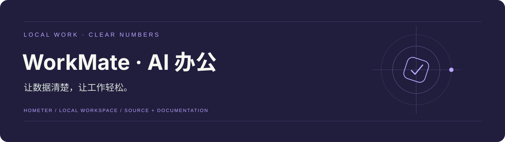
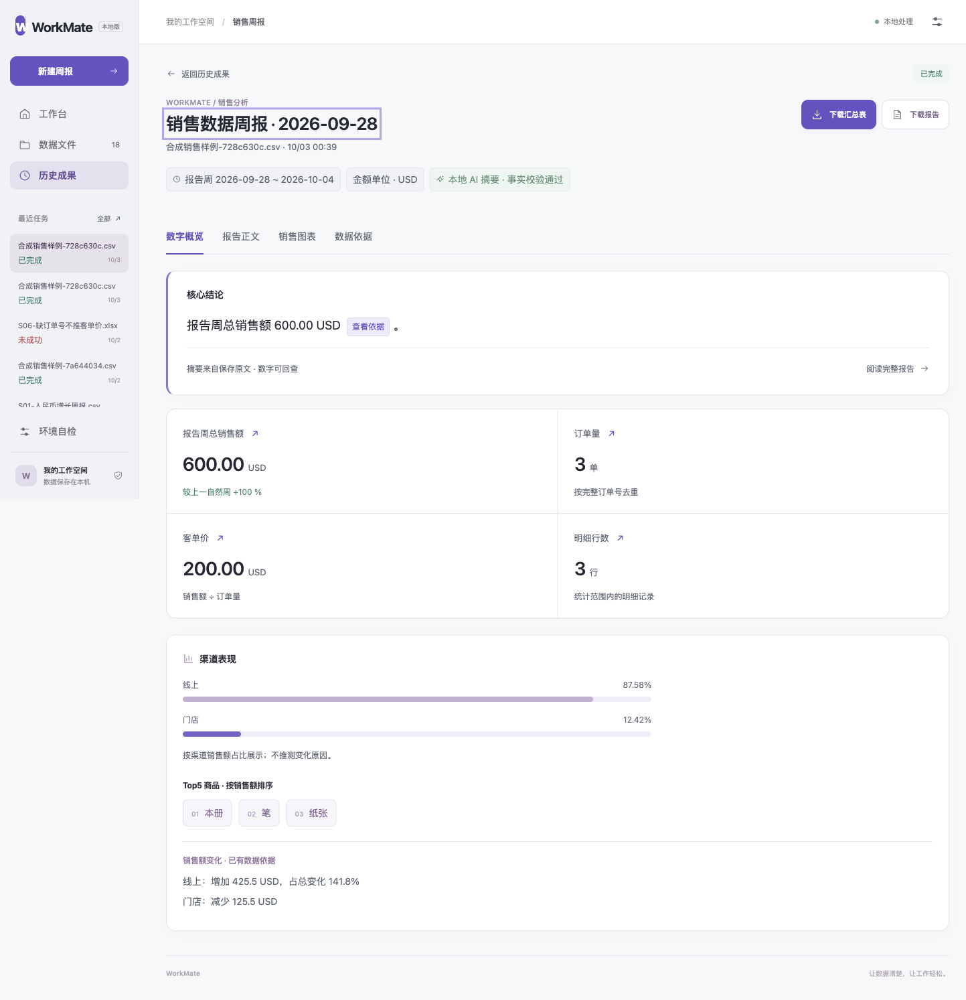

<div align="center">



# WorkMate · AI 办公

**让数据清楚，让工作轻松。**

[快速开始](#快速开始) · [配置说明](docs/配置说明.md) · [文档导航](docs/README.md) · [项目状态](docs/项目状态.md)

</div>

## 项目介绍

面向运营、销售和小团队的本地销售周报助手。上传 XLSX / CSV，检查字段和金额口径，生成可回查依据的报告、图表与汇总表。原始文件保持只读，默认模型在本机运行。

## 界面预览



实际报告页，使用授权合成销售样表与真实本地 Qwen。它展示当前 A 分期成果，不能视为企业真实业务试用。

## 核心功能

- 数据检查：字段映射、报告周与对比周、A/B 金额口径，以及缺失信息阻断和人工确认。
- 事实与摘要：数字核对、总结事实校验、明确模型或确定性降级身份。
- 阅读与交付：数字概览、报告正文、图表、依据引用和实际文件下载。
- 持续使用：历史搜索与筛选、任务状态持久化、刷新恢复、环境自检与错误重试。

## 快速开始

准备 Python 3.12；运行网页无需 Node.js。开发检查另需 Node.js 22；真实摘要需自行安装 Ollama 与模型。 下列命令适用于 macOS / Linux。先安装依赖：

```bash
git clone https://github.com/Hometer/workmate-ai-office.git
cd workmate-ai-office
python3.12 -m venv .venv
.venv/bin/python -m pip install -r requirements.txt
cp .env.example .env
```

启动服务：

```bash
# 先使用离线示例了解流程
WORKMATE_MODEL_PROVIDER=mock .venv/bin/python -m workmate serve --port 8000
# 另一个终端可以检查环境
.venv/bin/python -m workmate diagnose
```

打开 <http://127.0.0.1:8000>；API 文档在 <http://127.0.0.1:8000/docs>。按 `Control+C` 停止对应服务。

## 配置说明

在 `.env` 指定数据目录与成果目录。默认真实模型方案为本地 Ollama；离线演示可用 mock。安装 Ollama 后运行 `ollama pull qwen2.5:7b`，设置 `WORKMATE_MODEL_PROVIDER=ollama` 并重启服务。网页先「检查数据并继续」，确认口径再生成。

详细参数、数据位置和工程检查见 [配置说明](docs/配置说明.md)。仓库不包含本机密钥、业务数据、依赖目录或运行缓存。

## 当前范围

v0.8 A 与 v0.9 A 当前范围已按授权合成样表及真实本地模型完成验收。真实企业样表、5 人连续试用和后续 B/C/D 分期尚未完成；当前能力聚焦销售周报。

以 [项目状态](docs/项目状态.md)、当前 PRD 与对应验收记录为准。历史测试与截图标明其范围，本次上传不新增产品验收结论。

## 文档与代码

`workmate/` 为 Python 服务与原生 HTML/CSS/JavaScript 网页，`tests/` 为回归检查。Node.js 工具仅用于前端检查与静态构建。

[文档导航](docs/README.md) · [当前需求](docs/PRD/PRD-v0.9.md) · [配置与检查](docs/配置说明.md)

<details>
<summary>展开开发手册、需求与验收记录</summary>

- [需求与 PRD](docs/PRD/)
- [开发手册与操作说明](docs/手册/)
- [技术适配与阶段开发文档](docs/阶段文档/)
- [验收记录与实际界面证据](docs/evidence/)
- [历史首页与分期开发记录](docs/历史/开发记录.md)
- [本次仓库整理记录](docs/仓库整理记录.md)

</details>

## 许可与来源

保留原项目 [LICENSE](LICENSE) 与作者署名。项目由 AI 产品开发工具包起步；历史规则与必要文档保留，新增整理以实际实现为准。
